# Design Document

## Overview

The soc-validation infrastructure is a lightweight, containerized system designed for a 3-month implementation timeline. Following the technical steering architecture, it leverages Prefect Server 3.x, FastAPI, and Redis to provide basic test orchestration for compiler and runtime teams. The design prioritizes simplicity and quick deployment over advanced features, targeting 10-20 boards and 200+ tests/day for 1-2 pilot teams.

## Steering Document Alignment

### Technical Standards (tech.md)
- Uses Prefect Server 3.x in Docker as the orchestration engine
- Python 3.12+ with strict typing and async/await patterns
- FastAPI with Pydantic v2 for the Device Manager API
- Redis 7.4+ for distributed locks and simple queuing
- Single-server deployment with Docker Compose
- **Dependency Note:** prometheus-client>=0.20.0 required for Prefect 3.0.0 compatibility

### Project Structure (structure.md)
- Follows the defined directory structure with src/, tests/, docs/, and scripts/
- Uses snake_case for Python modules and proper import patterns
- Configuration via .env files and boards.yaml
- Local artifact storage under /data/artifacts

## Code Reuse Analysis

### Existing Components to Leverage
- **Prefect Server Container**: Use the existing Dockerfile and docker-compose.yml
- **Makefile**: Extend with new targets for device manager and worker operations
- **Environment Configuration**: Build on .env.example pattern
- **Health Checks**: Extend existing /api/health pattern

### Integration Points
- **Prefect API**: Use native Prefect SDK for flow/task submission
- **Docker Networks**: Leverage existing Docker networking setup
- **Port Configuration**: Follow existing parameterized port patterns
- **Volume Mounts**: Use existing data persistence strategy

## Architecture

The system follows a hybrid architecture with centralized orchestration and distributed execution:

### Modular Design Principles
- **Single File Responsibility**: Each module handles one specific domain
- **Centralized Orchestration**: Prefect server and device manager on single host
- **Distributed Execution**: Workers deployed near lab infrastructure for low latency
- **Minimal External Dependencies**: Redis for locking, local filesystem for storage
- **Pluggable Drivers**: Telnet clients for remote board access

```mermaid
graph TD
    subgraph "Central Orchestrator (Single Server)"
        subgraph "Core Services"
            PS[Prefect Server 3.x]
            DB[(SQLite with aiosqlite)]
            PS --> DB
        end

        subgraph "Support Services"
            DM[Device Manager API]
            Redis[(Redis)]
            DM --> Redis
        end

        subgraph "Notification Layer"
            NS[Notification Service]
        end
    end

    subgraph "Distributed Workers"
        subgraph "Worker Node A"
            PWA[Prefect Worker A]
            TelnetA[Telnet Client]
            FSA[Local Storage]
            PWA --> TelnetA
            PWA --> FSA
        end

        subgraph "Worker Node B"
            PWB[Prefect Worker B]
            TelnetB[Telnet Client]
            FSB[Local Storage]
            PWB --> TelnetB
            PWB --> FSB
        end

        subgraph "Worker Node C"
            PWC[Prefect Worker C]
            TelnetC[Telnet Client]
            FSC[Local Storage]
            PWC --> TelnetC
            PWC --> FSC
        end
    end

    subgraph "Remote Lab Infrastructure"
        subgraph "Lab Site A"
            BoardA1[Board soc-a-001<br/>10.1.1.101:23]
            BoardA2[Board soc-a-002<br/>10.1.1.102:23]
            BoardA3[Board soc-a-003<br/>10.1.1.103:23]
            BoardA4[Board soc-a-004<br/>10.1.1.104:23]
            BoardA5[Board soc-a-005<br/>10.1.1.105:23]
            PDUA[PDU A]
            PDUA --> BoardA1
            PDUA --> BoardA2
            PDUA --> BoardA3
            PDUA --> BoardA4
            PDUA --> BoardA5
        end

        subgraph "Lab Site B"
            BoardB1[Board soc-b-001<br/>10.1.2.101:23]
            BoardB2[Board soc-b-002<br/>10.1.2.102:23]
            BoardB3[Board soc-b-003<br/>10.1.2.103:23]
            BoardB4[Board soc-b-004<br/>10.1.2.104:23]
            BoardB5[Board soc-b-005<br/>10.1.2.105:23]
            PDUB[PDU B]
            PDUB --> BoardB1
            PDUB --> BoardB2
            PDUB --> BoardB3
            PDUB --> BoardB4
            PDUB --> BoardB5
        end

        subgraph "Lab Site C"
            BoardC1[Board soc-c-001<br/>10.1.3.101:23]
            BoardC2[Board soc-c-002<br/>10.1.3.102:23]
            BoardC3[Board soc-c-003<br/>10.1.3.103:23]
            BoardC4[Board soc-c-004<br/>10.1.3.104:23]
            BoardC5[Board soc-c-005<br/>10.1.3.105:23]
            BoardC6[Board soc-c-006<br/>10.1.3.106:23]
            BoardC7[Board soc-c-007<br/>10.1.3.107:23]
            BoardC8[Board soc-c-008<br/>10.1.3.108:23]
            BoardC9[Board soc-c-009<br/>10.1.3.109:23]
            BoardC10[Board soc-c-010<br/>10.1.3.110:23]
            PDUC[PDU C]
            PDUC --> BoardC1
            PDUC --> BoardC2
            PDUC --> BoardC3
            PDUC --> BoardC4
            PDUC --> BoardC5
            PDUC --> BoardC6
            PDUC --> BoardC7
            PDUC --> BoardC8
            PDUC --> BoardC9
            PDUC --> BoardC10
        end
    end

    subgraph "External Services"
        Slack[Slack/Feishu]
        Jenkins[Jenkins CI]
    end

    %% Worker connections to orchestrator
    PWA -."API".-> PS
    PWB -."API".-> PS
    PWC -."API".-> PS
    PWA -."HTTP".-> DM
    PWB -."HTTP".-> DM
    PWC -."HTTP".-> DM

    %% Worker connections directly to boards via telnet
    TelnetA -."Telnet:23".-> BoardA1
    TelnetA -."Telnet:23".-> BoardA2
    TelnetA -."Telnet:23".-> BoardA3
    TelnetA -."Telnet:23".-> BoardA4
    TelnetA -."Telnet:23".-> BoardA5
    TelnetB -."Telnet:23".-> BoardB1
    TelnetB -."Telnet:23".-> BoardB2
    TelnetB -."Telnet:23".-> BoardB3
    TelnetB -."Telnet:23".-> BoardB4
    TelnetB -."Telnet:23".-> BoardB5
    TelnetC -."Telnet:23".-> BoardC1
    TelnetC -."Telnet:23".-> BoardC2
    TelnetC -."Telnet:23".-> BoardC3
    TelnetC -."Telnet:23".-> BoardC4
    TelnetC -."Telnet:23".-> BoardC5
    TelnetC -."Telnet:23".-> BoardC6
    TelnetC -."Telnet:23".-> BoardC7
    TelnetC -."Telnet:23".-> BoardC8
    TelnetC -."Telnet:23".-> BoardC9
    TelnetC -."Telnet:23".-> BoardC10

    %% Device Manager to PDUs
    DM -."HTTP/SNMP".-> PDUA
    DM -."HTTP/SNMP".-> PDUB
    DM -."HTTP/SNMP".-> PDUC

    %% External connections
    NS --> Slack
    Slack -."Webhooks".-> PS
    Jenkins -."Webhooks".-> PS
    PWA --> NS
    PWB --> NS
    PWC --> NS
```



## Components and Interfaces

### Prefect Server
- **Purpose:** Orchestration control plane
- **Implementation:**
  - Custom Prefect Server Docker image with aiosqlite support
  - Configure with single work pool for MVP
  - SQLite with aiosqlite for async database operations
- **Configuration:**
  ```yaml
  # docker-compose.yml addition
  prefect:
    build:
      context: .
      dockerfile: Dockerfile.prefect
    environment:
      PREFECT_SERVER_API_HOST: 0.0.0.0
      PREFECT_API_DATABASE_CONNECTION_URL: sqlite+aiosqlite:////data/prefect.db
  ```
- **Custom Dockerfile.prefect:**
  ```dockerfile
  FROM prefecthq/prefect:3-python3.12
  # Install curl for health checks and aiosqlite for async SQLite support
  RUN apt-get update && apt-get install -y curl && rm -rf /var/lib/apt/lists/* && \
      pip install --no-cache-dir aiosqlite
  ```

### Device Manager Service
- **Purpose:** Simple board allocation and control
- **Interfaces:**
  ```python
  # FastAPI endpoints
  POST /api/v1/lease     # Request a board
  DELETE /api/v1/lease/{lease_id}  # Release a board
  GET /api/v1/boards     # List available boards
  GET /api/v1/health     # Service health check
  POST /api/v1/power/{board_id}/{action}  # Power control

  # Webhook endpoints for external triggers
  POST /webhooks/slack    # Slack command webhooks
  POST /webhooks/feishu   # Feishu command webhooks
  POST /webhooks/jenkins  # Jenkins CI webhooks
  ```
- **Implementation:**
  ```python
  # src/device_manager/api.py
  from fastapi import FastAPI, HTTPException
  from pydantic import BaseModel
  import redis

  app = FastAPI(title="Device Manager", version="0.1.0")
  redis_client = redis.Redis(host="redis", port=6379, decode_responses=True)

  class LeaseRequest(BaseModel):
      board_family: str
      timeout: int = 1800  # 30 minutes default

  @app.post("/api/v1/lease")
  async def acquire_lease(request: LeaseRequest):
      # Simple first-available allocation
      # Use Redis SET NX for atomic locking
      pass
  ```

### Prefect Worker (Distributed)
- **Purpose:** Execute test flows on distributed worker nodes
- **Deployment:** Workers run on separate machines/VMs near lab infrastructure
- **Implementation:**
  ```python
  # src/flows/test_pipeline.py
  from prefect import flow, task
  from prefect.tasks import task_input_hash
  from datetime import timedelta
  import os

  # Worker identifies itself and its capabilities
  WORKER_ID = os.getenv("WORKER_ID", "worker-unknown")
  WORKER_LOCATION = os.getenv("WORKER_LOCATION", "unknown")

  @task(retries=3, retry_delay_seconds=30)
  async def acquire_board(board_family: str) -> dict:
      """Request board from central Device Manager."""
      device_manager_url = os.getenv("DEVICE_MANAGER_URL")
      async with httpx.AsyncClient() as client:
          response = await client.post(
              f"{device_manager_url}/api/v1/lease",
              json={
                  "board_family": board_family,
                  "worker_id": WORKER_ID,
                  "preferred_location": WORKER_LOCATION
              }
          )
          return response.json()

  @flow(name="test-execution")
  async def test_pipeline(
      test_binary: str,
      board_family: str,
      priority: int = 2
  ):
      """Main test execution flow."""
      board = await acquire_board(board_family)
      try:
          # Worker connects directly to board via telnet
          result = await run_test_locally(board, test_binary)
          await send_notification(result)
          return result
      finally:
          await release_board(board["lease_id"])
  ```

### Webhook Integration
- **Purpose:** Enable external systems to trigger test workflows
- **Supported Integrations:**
  - **Slack:** Slash commands (e.g., `/run-test socA`)
  - **Feishu:** Bot commands and event callbacks
  - **Jenkins:** CI pipeline webhooks for automated testing
- **Security:**
  - Verification tokens for each webhook source
  - Request signature validation
  - Rate limiting to prevent abuse
- **Implementation:**
  ```python
  # Webhook handler in Notification Service
  @app.post("/webhooks/slack")
  async def handle_slack_command(request: Request):
      # Verify request signature
      if not verify_slack_signature(request):
          raise HTTPException(401, "Invalid signature")

      # Parse command and trigger workflow
      payload = await request.json()
      # ... trigger Prefect deployment
  ```

### Queue Manager (Simplified)
- **Purpose:** Basic priority queue using Prefect's native features
- **Implementation:**
  - Use Prefect work pools with priority
  - No complex scheduling or preemption
  - Simple FIFO within priority levels
- **Configuration:**
  ```python
  # scripts/setup_queue.py
  from prefect import get_client

  async def setup_work_pool():
      async with get_client() as client:
          await client.create_work_pool(
              name="soc-test-pool",
              type="process",
              base_job_template={
                  "job_configuration": {
                      "command": "python -m prefect.engine"
                  }
              }
          )
  ```

### Notification Service (Bidirectional)
- **Purpose:** Send test notifications and receive workflow triggers from Slack/Feishu
- **Implementation:**
  ```python
  # src/notifications/notifier.py
  import httpx
  from typing import Optional
  from fastapi import FastAPI, Request

  app = FastAPI(title="Notification Service")

  class SimpleNotifier:
      def __init__(self, webhook_url: Optional[str] = None):
          self.webhook_url = webhook_url or os.getenv("SLACK_WEBHOOK_URL")

      async def send_notification(self, message: str):
          if not self.webhook_url:
              return  # Silently skip if not configured

          try:
              async with httpx.AsyncClient() as client:
                  await client.post(
                      self.webhook_url,
                      json={"text": message}
                  )
          except Exception as e:
              logger.error(f"Notification failed: {e}")
              # Don't block test execution

  # Webhook endpoint for Slack/Feishu to trigger workflows
  @app.post("/webhooks/slack")
  async def slack_webhook(request: Request):
      """Handle Slack slash commands or event callbacks."""
      payload = await request.json()

      # Parse Slack command (e.g., /run-test board-family)
      if "command" in payload:
          command = payload["command"]
          text = payload.get("text", "")

          if command == "/run-test":
              # Trigger Prefect workflow
              async with httpx.AsyncClient() as client:
                  await client.post(
                      "http://prefect:4200/api/deployments/run",
                      json={
                          "deployment_id": "test-execution",
                          "parameters": {
                              "board_family": text,
                              "priority": 2
                          }
                      }
                  )
              return {"text": f"Test triggered for {text}"}

      return {"text": "Command not recognized"}
  ```

### Hardware Drivers (Direct Board Access)
- **Purpose:** Control boards via direct telnet connections to each SoC board
- **Implementation:**
  ```python
  # src/device_manager/drivers/telnet_driver.py
  import telnetlib
  import asyncio
  from typing import Optional

  class TelnetDriver:
      def __init__(self, board_ip: str, port: int = 23, username: Optional[str] = None, password: Optional[str] = None):
          self.board_ip = board_ip
          self.port = port
          self.username = username
          self.password = password

      async def execute_command(self, command: str, timeout: int = 30) -> str:
          """Execute command via direct telnet to SoC board."""
          try:
              # Direct connection to board's telnet endpoint
              tn = telnetlib.Telnet(self.board_ip, self.port, timeout=timeout)

              # Login if required
              if self.username:
                  tn.read_until(b"login: ", timeout=5)
                  tn.write(f"{self.username}\n".encode())
                  if self.password:
                      tn.read_until(b"Password: ", timeout=5)
                      tn.write(f"{self.password}\n".encode())

              # Wait for prompt and execute command
              tn.read_until(b"# ", timeout=5)
              tn.write(f"{command}\n".encode())

              # Read output until next prompt
              output = tn.read_until(b"# ", timeout=timeout).decode()
              tn.close()
              return output
          except Exception as e:
              raise ConnectionError(f"Telnet to {self.board_ip}:{self.port} failed: {e}")

  # src/device_manager/drivers/power.py
  import httpx

  class RemotePowerDriver:
      """Control remote PDUs via HTTP or SNMP."""
      def __init__(self, pdu_host: str, pdu_type: str = "apc"):
          self.pdu_host = pdu_host
          self.pdu_type = pdu_type

      async def power_cycle(self, outlet: int):
          """Power cycle via PDU API."""
          if self.pdu_type == "apc":
              # APC PDU HTTP API example
              async with httpx.AsyncClient() as client:
                  # Power off
                  await client.post(
                      f"http://{self.pdu_host}/outlet/{outlet}/off"
                  )
                  await asyncio.sleep(5)
                  # Power on
                  await client.post(
                      f"http://{self.pdu_host}/outlet/{outlet}/on"
                  )
  ```

## Data Models

### Board Configuration
```python
# src/device_manager/models.py
from pydantic import BaseModel
from typing import Optional
from datetime import datetime

class Board(BaseModel):
    board_id: str           # e.g., "soc-a-001"
    soc_family: str         # e.g., "socA"
    soc_revision: str       # e.g., "rev2"
    board_ip: str           # e.g., "10.1.1.101" - Direct IP of board
    telnet_port: int = 23   # Standard telnet port
    pdu_host: str          # e.g., "pdu-a.lab.local"
    pdu_outlet: int        # e.g., 1
    lab_location: str      # e.g., "Lab Site A"
    health_status: str = "healthy"  # healthy/unhealthy
    failure_count: int = 0
    last_used: Optional[datetime] = None
    telnet_username: Optional[str] = None  # If login required
    telnet_password: Optional[str] = None  # If password required
```

### Lease Model
```python
class Lease(BaseModel):
    lease_id: str           # UUID
    board_id: str           # Board identifier
    flow_run_id: Optional[str]  # Prefect flow run ID
    acquired_at: datetime
    expires_at: datetime    # TTL expiration
    status: str = "active"  # active/expired/released
```

### Test Result
```python
class TestResult(BaseModel):
    result_id: str          # UUID
    flow_run_id: str        # Prefect flow run ID
    board_id: str
    test_binary: str
    started_at: datetime
    completed_at: Optional[datetime]
    status: str             # running/passed/failed/timeout
    output_file: str        # Path to log file
    error_message: Optional[str] = None
```

### Queue Entry (Using Prefect's built-in)
```python
# Prefect handles queue internally, we just set priority
deployment_params = {
    "test_binary": "/path/to/test",
    "board_family": "socA",
    "priority": 1  # 1=high, 2=normal, 3=low
}
```

## Error Handling

### Error Scenarios

1. **No Boards Available**
   - **Handling:** Return HTTP 503, retry after delay
   - **User Impact:** Test queued, notification sent about delay

2. **Board Communication Failure**
   - **Handling:** Telnet timeout/failure, mark board unhealthy, retry with different board
   - **User Impact:** Automatic retry, slight delay
   - **Network Issues:** Log connection details for debugging remote access

3. **Test Timeout (30 minutes)**
   - **Handling:** Kill process, release board, mark as timeout
   - **User Impact:** Notification with timeout status

4. **Redis Connection Lost**
   - **Handling:** Fallback to in-memory locks (single worker only)
   - **User Impact:** Degraded performance, possible duplicate leases

5. **Notification Failure**
   - **Handling:** Log error, continue test execution
   - **User Impact:** May miss notification, check UI

## Testing Strategy

### Unit Testing

- **Device Manager:** Mock Redis, test lease logic with worker affinity
- **Flows:** Mock HTTP calls to device manager
- **Drivers:** Mock telnet connections
- **Worker Registration:** Test worker heartbeat and capabilities
- **Target:** 60% coverage minimum

### Integration Testing

- **End-to-end:** Submit test, verify execution on distributed workers
- **Queue:** Test priority ordering across multiple workers
- **Lease Management:** Test concurrent requests with worker affinity
- **Worker Failover:** Test handling of worker disconnection
- **Limited scope due to 3-month timeline**

### Manual Testing

- **Board Control:** Verify direct telnet connectivity from each worker to all boards in its assigned lab site
- **Power Control:** Test PDU API access from device manager to all lab sites
- **Network Connectivity:**
  - Workers can reach orchestrator API (port 4200, 8000)
  - Workers can telnet directly to board IPs (port 23)
  - Orchestrator can reach PDUs via HTTP/SNMP
- **Worker Registration:** Verify all workers register with Prefect server
- **Notifications:** Test Slack/Feishu delivery from notification service
- **UI:** Verify Prefect UI shows all distributed workers
- **Jenkins:** Test webhook integration if implemented

## Deployment Configuration

### Central Orchestrator (docker-compose.yml)
```yaml
version: '3.9'
services:
  prefect:
    build:
      context: .
      dockerfile: Dockerfile.prefect
    ports:
      - "4200:4200"
    volumes:
      - prefect-data:/data
      - ./config:/app/config:ro
    environment:
      - PREFECT_SERVER_API_HOST=0.0.0.0
      - PREFECT_SERVER_API_PORT=4200
      - PREFECT_API_DATABASE_CONNECTION_URL=sqlite+aiosqlite:////data/prefect.db
      - PREFECT_API_URL=http://localhost:4200/api
      - PREFECT_SERVER_ANALYTICS_ENABLED=false
    healthcheck:
      test: ["CMD", "curl", "-f", "http://localhost:4200/api/health"]
      interval: 30s
      timeout: 10s
      retries: 3
    networks:
      - orchestrator-net

  device-manager:
    build: ./src/device_manager
    ports:
      - "8000:8000"
    volumes:
      - ./boards.yaml:/config/boards.yaml
    environment:
      - REDIS_URL=redis://redis:6379
      - PREFECT_API_URL=http://prefect:4200/api
    networks:
      - orchestrator-net

  redis:
    image: redis:7.4-alpine
    ports:
      - "6379:6379"
    networks:
      - orchestrator-net

  notification-service:
    build: ./src/notifications
    ports:
      - "9000:9000"  # Expose for incoming webhooks
    environment:
      - SLACK_WEBHOOK_URL=${SLACK_WEBHOOK_URL}
      - FEISHU_WEBHOOK_URL=${FEISHU_WEBHOOK_URL}
      - PREFECT_API_URL=http://prefect:4200/api
    networks:
      - orchestrator-net

networks:
  orchestrator-net:
    driver: bridge
```

### Distributed Workers (worker-compose.yml)
```yaml
# Deploy this on each worker node
version: '3.9'
services:
  worker:
    build: ./src/worker
    volumes:
      - ./data/artifacts:/artifacts
      - ./data/tests:/tests
    environment:
      - PREFECT_API_URL=http://${ORCHESTRATOR_IP}:4200/api
      - DEVICE_MANAGER_URL=http://${ORCHESTRATOR_IP}:8000
      - NOTIFICATION_SERVICE_URL=http://${ORCHESTRATOR_IP}:9000
      - WORKER_ID=${WORKER_ID}
      - WORKER_LOCATION=${WORKER_LOCATION}
    extra_hosts:
      - "orchestrator:${ORCHESTRATOR_IP}"
    networks:
      - worker-net

networks:
  worker-net:
    driver: bridge
```

### Configuration Files
```yaml
# boards.yaml
boards:
  # Lab Site A boards - Direct telnet endpoints
  - board_id: soc-a-001
    soc_family: socA
    soc_revision: rev2
    board_ip: 10.1.1.101
    telnet_port: 23
    pdu_host: pdu-a.lab.local
    pdu_outlet: 1
    lab_location: "Lab Site A"

  - board_id: soc-a-002
    soc_family: socA
    soc_revision: rev2
    board_ip: 10.1.1.102
    telnet_port: 23
    pdu_host: pdu-a.lab.local
    pdu_outlet: 2
    lab_location: "Lab Site A"

  # Lab Site B boards - Direct telnet endpoints
  - board_id: soc-b-001
    soc_family: socB
    soc_revision: rev1
    board_ip: 10.1.2.101
    telnet_port: 23
    pdu_host: pdu-b.lab.local
    pdu_outlet: 1
    lab_location: "Lab Site B"
    telnet_username: admin  # Some boards may require login
    telnet_password: ${BOARD_B001_PASSWORD}  # Stored in env

  # ... up to 20 boards across different sites
```

### Environment Variables

#### Orchestrator (.env)
```bash
# Central orchestrator configuration
SERVER_IP=10.0.1.100
PREFECT_API_URL=http://10.0.1.100:4200/api
DEVICE_MANAGER_URL=http://10.0.1.100:8000
NOTIFICATION_SERVICE_URL=http://10.0.1.100:9000
REDIS_URL=redis://localhost:6379

# Outgoing webhook URLs (for sending notifications)
SLACK_WEBHOOK_URL=https://hooks.slack.com/services/XXX
FEISHU_WEBHOOK_URL=https://open.feishu.cn/open-apis/bot/v2/hook/XXX

# Webhook verification tokens (for receiving commands)
SLACK_VERIFICATION_TOKEN=xxx-xxx-xxx
FEISHU_VERIFICATION_TOKEN=yyy-yyy-yyy
```

#### Worker Nodes (.env.worker)
```bash
# Worker node configuration
ORCHESTRATOR_IP=10.0.1.100
WORKER_ID=worker-a
WORKER_LOCATION=Lab Site A
ARTIFACT_PATH=/data/artifacts
ARTIFACT_RETENTION_DAYS=7
MAX_DISK_USAGE_GB=100
```

## Performance Considerations

### MVP Performance Targets
- **API Response:** <500ms average (Redis operations are fast)
- **Board Lease:** <10 seconds (including health check)
- **Queue Operations:** <5 seconds (Prefect handles this)
- **Notification Delivery:** Fire-and-forget, don't wait
- **Concurrent Users:** 10 (limited by single server)

### Optimization Strategies
- Keep Redis operations atomic and simple
- Use async/await for I/O operations
- Cache board status in Redis with TTL
- Batch notifications if volume increases
- Monitor disk usage for artifacts

## Security Considerations

### Basic Security (MVP)
- No user authentication (rely on network isolation)
- Secrets in .env files (not in code)
- Docker network isolation between services
- Basic webhook validation for Jenkins
- No TLS for internal services (Docker network)
- Telnet credentials stored securely in environment variables
- Network ACLs to restrict access to lab infrastructure
- VPN or private network for lab connectivity

### Future Security Enhancements (Post-MVP)
- Add API key authentication
- Implement TLS for external endpoints
- Use secrets management (Vault)
- Add audit logging
- Implement RBAC
