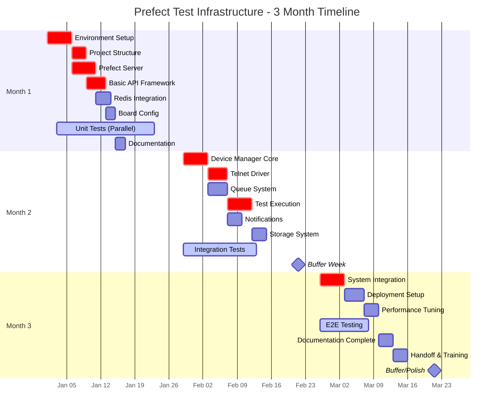
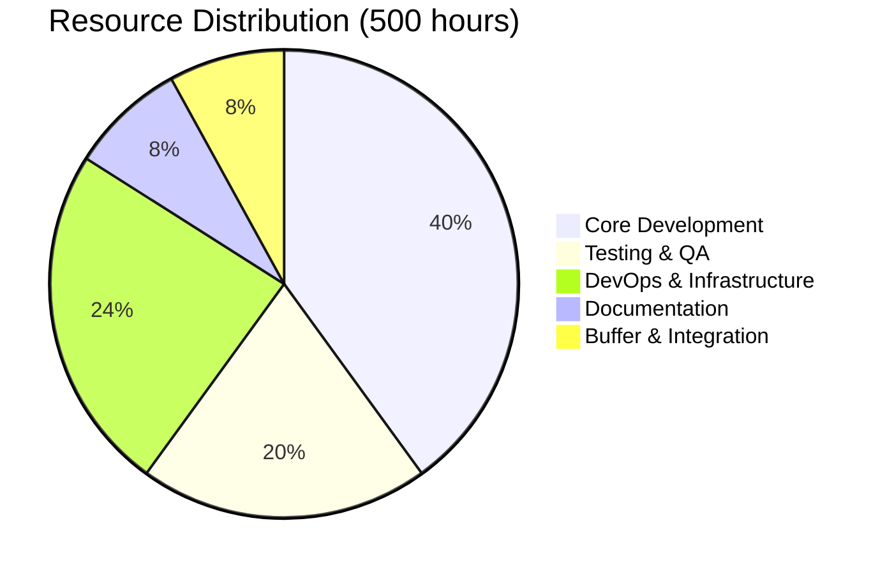
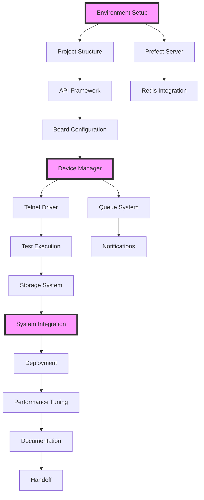
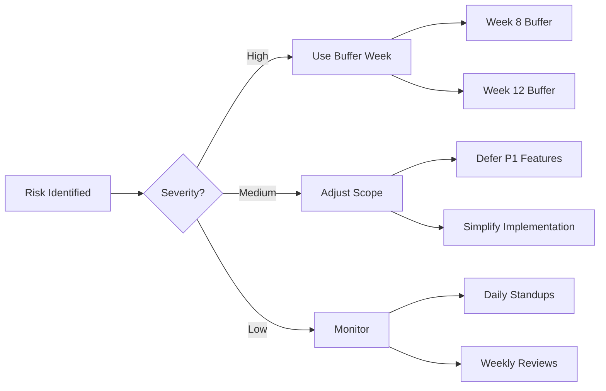

# Tasks Document

## Overview

This document provides a comprehensive implementation plan for the soc-validation infrastructure, organized for a 3-month timeline with integrated testing, incremental documentation, and buffer periods for risk mitigation.

## Progress Tracking

### Week 1: Environment Setup and Early QA
- [x] 1. Set up development environment
  - Configure local development environment with Docker, Python 3.12+
  - Files: docker-compose.yml, Dockerfile, .env.example
  - _Requirements: 1, 2_
- [x] 2. Create project structure with testing framework
  - Initialize Python project with Prefect structure and testing setup
  - Files: pyproject.toml, pytest.ini, src/, tests/
  - _Requirements: NFR_
- [x] 3. Deploy Prefect Server locally
  - Run Prefect Server 3.x in Docker with basic configuration
  - Files: docker-compose.yml, Makefile
  - _Requirements: 1_
- [x] 4. Define API contracts early
  - Create OpenAPI spec for device manager API
  - Files: docs/openapi.yaml, src/device_manager/models.py
  - _Requirements: 1, 6_

### Week 2: Core Components
- [x] 5. Implement basic FastAPI application
  - Create device manager API skeleton with health endpoints
  - Files: src/device_manager/api.py, src/device_manager/__init__.py
  - _Requirements: 2, 6_
- [x] 6. Set up Redis for distributed locking
  - Deploy Redis 7.4+ and implement lock manager
  - Files: src/device_manager/lock_manager.py, docker-compose.yml
  - _Requirements: 2, 3_
- [x] 7. Create board configuration system
  - YAML-based board inventory management
  - Files: config/boards.yaml, src/device_manager/config.py
  - _Requirements: 2, 3_

### Week 3: Device Management Foundation
- [ ] 8. Implement device manager core with tests
  - Core logic for board allocation and leasing
  - Files: src/device_manager/manager.py, tests/unit/test_device_manager.py
  - _Requirements: 3_
- [ ] 9. Create telnet driver for board communication
  - Telnet client for direct board access
  - Files: src/device_manager/drivers/telnet_driver.py
  - _Requirements: 2, 6_
- [ ] 10. Build basic power control scripts
  - Shell scripts for PDU control
  - Files: scripts/power_control.sh, src/device_manager/drivers/power.py
  - _Requirements: 2_

### Week 4: Queue and Workflow Basics
- [ ] 11. Implement priority queue system
  - FIFO queue with 3 priority levels
  - Files: src/queue/priority_queue.py, tests/unit/test_queue.py
  - _Requirements: 4_
- [ ] 12. Create first Prefect flow
  - Basic test execution flow
  - Files: src/flows/test_execution.py
  - _Requirements: 1, 6_
- [ ] 13. API endpoint for test submission
  - REST endpoint to submit tests to queue
  - Files: src/device_manager/api.py
  - _Requirements: 4, 6_
- [ ] 14. Month 1 integration testing
  - End-to-end test of basic flow
  - Files: tests/integration/test_basic_flow.py
  - _Requirements: NFR_

### Week 5: Test Execution
- [ ] 15. Implement test binary transfer
  - Copy test binaries to boards via SCP/SFTP
  - Files: src/tasks/file_transfer.py
  - _Requirements: 6_
- [ ] 16. Execute tests via serial console
  - Run tests and capture output via telnet
  - Files: src/tasks/test_execution.py
  - _Requirements: 6_
- [ ] 17. Implement test result collection
  - Capture and store test outputs
  - Files: src/storage/results.py
  - _Requirements: 6, 7_

### Week 6: Notifications and Storage
- [ ] 18. Slack integration for notifications
  - Send test completion notifications to Slack
  - Files: src/notifications/slack.py
  - _Requirements: 5_
- [ ] 19. Implement artifact storage system
  - Organize and manage test artifacts
  - Files: src/storage/artifacts.py
  - _Requirements: 7_
- [ ] 20. Create test history API
  - Query test results and history
  - Files: src/device_manager/api.py
  - _Requirements: 7_

### Week 7: Advanced Features
- [ ] 21. Queue visibility in Prefect UI
  - Display queue status in Prefect dashboard
  - Files: src/flows/queue_monitor.py
  - _Requirements: 1, 4_
- [ ] 22. Board health monitoring
  - Track board failures and auto-quarantine
  - Files: src/device_manager/health.py
  - _Requirements: 3_
- [ ] 23. Simple wait time estimation
  - Calculate estimated wait based on queue length
  - Files: src/queue/estimator.py
  - _Requirements: 4_

### Week 8: Buffer Week
- [ ] 24. Integration testing and bug fixes
  - Comprehensive integration testing
  - Files: tests/integration/, tests/e2e/
  - _Requirements: NFR_
- [ ] 25. Documentation checkpoint
  - Complete documentation for Month 1-2 components
  - Files: docs/
  - _Requirements: NFR_

### Week 9: System Integration
- [ ] 26. Full system integration
  - Connect all components in production configuration
  - Files: docker-compose.yml, scripts/deploy.sh
  - _Requirements: NFR_
- [ ] 27. Docker Compose deployment
  - Production-ready Docker Compose setup
  - Files: docker-compose.prod.yml
  - _Requirements: NFR_

### Week 10: Performance and Reliability
- [ ] 28. Performance optimization
  - Optimize system for target metrics
  - Files: src/
  - _Requirements: NFR_
- [ ] 29. Reliability improvements
  - Add retry logic and error recovery
  - Files: src/utils/retry.py
  - _Requirements: NFR_
- [ ] 30. End-to-end testing
  - Complete E2E test suite
  - Files: tests/e2e/
  - _Requirements: NFR_

### Week 11: Documentation and Training
- [ ] 31. Complete user documentation
  - User guides and API documentation
  - Files: docs/user_guide.md, docs/api.md
  - _Requirements: NFR_
- [ ] 32. Create operational runbooks
  - Operations and maintenance procedures
  - Files: docs/runbooks/
  - _Requirements: NFR_
- [ ] 33. Pilot team training
  - Train pilot team on system usage
  - Files: docs/training/
  - _Requirements: NFR_

### Week 12: Handoff and Buffer
- [ ] 34. Production deployment
  - Deploy to production environment
  - Files: scripts/deploy_prod.sh
  - _Requirements: NFR_
- [ ] 35. Operations team handoff
  - Transfer ownership to operations team
  - Files: docs/handoff.md
  - _Requirements: NFR_
- [ ] 36. Project retrospective and roadmap
  - Review project and plan next phase
  - Files: docs/retrospective.md
  - _Requirements: NFR_

### Summary
- **Total Tasks**: 36
- **Completed**: 2 (5.6%)
- **In Progress**: 1 (2.8%)
- **Pending**: 33 (91.6%)
- **Current Week**: Week 1 of 12

## Timeline Visualization

## Resource Allocation

## Task Dependencies

## Risk Mitigation Strategy

## Project Timeline

- **Month 1**: Foundation with parallel testing (Weeks 1-4)
- **Month 2**: Core features with buffer week (Weeks 5-8)
- **Month 3**: Integration, deployment, and handoff (Weeks 9-12)

## Resource Allocation

- 1 Lead Developer (full-time)
- 1 Backend Developer (full-time)
- 1 DevOps Engineer (75%)
- 1 QA Engineer (50% from Week 1)
- **Total Hours**: ~500

## Implementation Tasks

### Month 1: Foundation with Testing (Weeks 1-4)

#### Week 1: Environment Setup and Early QA

##### [TASK-001] Set up development environment
- **Priority**: P0
- **Component**: Infrastructure
- **Description**: Configure local development environment with Docker, Python 3.12+
- **Acceptance Criteria**:
  - Docker and Docker Compose installed
  - Python 3.12+ with virtual environment
  - Git repository with CI/CD skeleton
  - Basic README.md with setup instructions
- **Estimated Hours**: 6
- **Assigned**: Lead Developer + DevOps

##### [TASK-002] Create project structure with testing framework
- **Priority**: P0
- **Component**: Core
- **Description**: Initialize Python project with Prefect structure and testing setup
- **Acceptance Criteria**:
  - Project follows structure.md layout
  - Pytest configured with coverage
  - Pre-commit hooks for linting
  - CI pipeline for tests
- **Estimated Hours**: 8
- **Assigned**: Lead Developer

##### [TASK-003] Deploy Prefect Server locally
- **Priority**: P0
- **Component**: Orchestration
- **Description**: Run Prefect Server 3.x in Docker with basic configuration
- **Acceptance Criteria**:
  - Prefect Server accessible at http://localhost:4200
  - Database persisted in Docker volume
  - Health checks passing
  - Basic work pool created
- **Estimated Hours**: 10
- **Assigned**: Backend Developer + DevOps

##### [TASK-004] Define API contracts early
- **Priority**: P0
- **Component**: API
- **Description**: Create OpenAPI spec for device manager API
- **Acceptance Criteria**:
  - OpenAPI 3.0 specification complete
  - Endpoints for board operations defined
  - Pydantic models designed
  - Contract tests written (not implemented)
- **Estimated Hours**: 8
- **Assigned**: Lead Developer + QA

#### Week 2: Core Components

##### [TASK-005] Implement basic FastAPI application
- **Priority**: P0
- **Component**: API
- **Description**: Create device manager API skeleton with health endpoints
- **Acceptance Criteria**:
  - FastAPI app with /health endpoint
  - Pydantic v2 models for requests/responses
  - Basic error handling
  - Unit tests (80% coverage)
- **Estimated Hours**: 12
- **Assigned**: Backend Developer

##### [TASK-006] Set up Redis for distributed locking
- **Priority**: P0
- **Component**: Infrastructure
- **Description**: Deploy Redis 7.4+ and implement lock manager
- **Acceptance Criteria**:
  - Redis running in Docker
  - Python Redis client configured
  - Distributed lock implementation
  - Lock acquisition/release tests
- **Estimated Hours**: 10
- **Assigned**: Backend Developer

##### [TASK-007] Create board configuration system
- **Priority**: P0
- **Component**: Device Management
- **Description**: YAML-based board inventory management
- **Acceptance Criteria**:
  - boards.yaml schema defined
  - Configuration loader with validation
  - 5 test boards configured
  - Unit tests for config parsing
- **Estimated Hours**: 8
- **Assigned**: Lead Developer

#### Week 3: Device Management Foundation

##### [TASK-008] Implement device manager core with tests
- **Priority**: P0
- **Component**: Device Management
- **Description**: Core logic for board allocation and leasing
- **Acceptance Criteria**:
  - Board lease/release logic
  - Redis-based locking integrated
  - Lease timeout handling
  - Unit tests (90% coverage)
  - Basic documentation
- **Estimated Hours**: 16
- **Assigned**: Lead Developer

##### [TASK-009] Create telnet driver for board communication
- **Priority**: P0
- **Component**: Device Management
- **Description**: Telnet client for direct board access
- **Acceptance Criteria**:
  - Telnet connection establishment
  - Command execution with timeout
  - Output capture and buffering
  - Mock telnet server for testing
  - Integration tests
- **Estimated Hours**: 14
- **Assigned**: Backend Developer

##### [TASK-010] Build basic power control scripts
- **Priority**: P0
- **Component**: Device Management
- **Description**: Shell scripts for PDU control (power on/off/cycle)
- **Acceptance Criteria**:
  - Power on/off/cycle scripts
  - Support for 1 PDU type
  - Error handling and logging
  - Manual testing documented
- **Estimated Hours**: 6
- **Assigned**: DevOps

#### Week 4: Queue and Workflow Basics

##### [TASK-011] Implement priority queue system
- **Priority**: P0
- **Component**: Queue Management
- **Description**: FIFO queue with 3 priority levels
- **Acceptance Criteria**:
  - Priority levels: high/normal/low
  - Queue position tracking
  - Redis-backed persistence
  - Unit tests with concurrent access
- **Estimated Hours**: 12
- **Assigned**: Backend Developer

##### [TASK-012] Create first Prefect flow
- **Priority**: P0
- **Component**: Orchestration
- **Description**: Basic test execution flow
- **Acceptance Criteria**:
  - Flow: allocate board → run test → release board
  - Error handling for each step
  - Logging integrated
  - Manual testing successful
- **Estimated Hours**: 10
- **Assigned**: Lead Developer

##### [TASK-013] API endpoint for test submission
- **Priority**: P0
- **Component**: API
- **Description**: REST endpoint to submit tests to queue
- **Acceptance Criteria**:
  - POST /api/v1/tests endpoint
  - Request validation
  - Queue integration
  - API tests (contract validation)
- **Estimated Hours**: 8
- **Assigned**: Backend Developer

##### [TASK-014] Month 1 integration testing
- **Priority**: P0
- **Component**: Testing
- **Description**: End-to-end test of basic flow
- **Acceptance Criteria**:
  - Submit test via API
  - Board allocated successfully
  - Mock test execution
  - Board released
  - All components integrated
- **Estimated Hours**: 8
- **Assigned**: QA + Lead Developer

### Month 2: Core Features (Weeks 5-8)

#### Week 5: Test Execution

##### [TASK-015] Implement test binary transfer
- **Priority**: P0
- **Component**: Test Execution
- **Description**: Copy test binaries to boards via SCP/SFTP
- **Acceptance Criteria**:
  - Binary upload to board
  - Checksum verification
  - Transfer progress tracking
  - Error handling
  - Integration tests
- **Estimated Hours**: 10
- **Assigned**: Backend Developer

##### [TASK-016] Execute tests via serial console
- **Priority**: P0
- **Component**: Test Execution
- **Description**: Run tests and capture output via telnet
- **Acceptance Criteria**:
  - Command execution on board
  - Real-time output capture
  - Timeout handling (30 min default)
  - Output parsing for pass/fail
  - Integration tests with mock board
- **Estimated Hours**: 12
- **Assigned**: Lead Developer

##### [TASK-017] Implement test result collection
- **Priority**: P0
- **Component**: Storage
- **Description**: Capture and store test outputs
- **Acceptance Criteria**:
  - Serial output saved to files
  - Test metadata recorded
  - Pass/fail status extracted
  - Local file storage organized
  - Unit tests
- **Estimated Hours**: 8
- **Assigned**: Backend Developer

#### Week 6: Notifications and Storage

##### [TASK-018] Slack integration for notifications
- **Priority**: P0
- **Component**: Notifications
- **Description**: Send test completion notifications to Slack
- **Acceptance Criteria**:
  - Slack webhook configuration
  - Success/failure messages
  - Test summary in notification
  - Error handling for failed sends
  - Manual testing with real Slack
- **Estimated Hours**: 8
- **Assigned**: Backend Developer

##### [TASK-019] Implement artifact storage system
- **Priority**: P0
- **Component**: Storage
- **Description**: Organize and manage test artifacts
- **Acceptance Criteria**:
  - Directory structure: /data/artifacts/{date}/{test_id}/
  - Automatic cleanup after 7 days
  - Disk usage monitoring
  - HTTP endpoint for downloads
  - Integration tests
- **Estimated Hours**: 10
- **Assigned**: Lead Developer

##### [TASK-020] Create test history API
- **Priority**: P1
- **Component**: API
- **Description**: Query test results and history
- **Acceptance Criteria**:
  - GET /api/v1/tests endpoint
  - Pagination support
  - Filter by date/status
  - Last 100 results default
  - API tests
- **Estimated Hours**: 8
- **Assigned**: Backend Developer

#### Week 7: Advanced Features

##### [TASK-021] Queue visibility in Prefect UI
- **Priority**: P0
- **Component**: UI
- **Description**: Display queue status in Prefect dashboard
- **Acceptance Criteria**:
  - Custom Prefect block for queue display
  - Show position and priority
  - Auto-refresh every 30 seconds
  - Manual testing
- **Estimated Hours**: 10
- **Assigned**: Lead Developer

##### [TASK-022] Board health monitoring
- **Priority**: P1
- **Component**: Device Management
- **Description**: Track board failures and auto-quarantine
- **Acceptance Criteria**:
  - Failure tracking in database
  - Auto-quarantine after 3 failures/day
  - Manual health status override
  - Health status API endpoint
  - Unit tests
- **Estimated Hours**: 10
- **Assigned**: Backend Developer

##### [TASK-023] Simple wait time estimation
- **Priority**: P1
- **Component**: Queue Management
- **Description**: Calculate estimated wait based on queue length
- **Acceptance Criteria**:
  - Average test duration tracking
  - Queue length × average duration
  - Display in API response
  - Accuracy within 50%
- **Estimated Hours**: 6
- **Assigned**: Backend Developer

#### Week 8: Buffer Week

##### [TASK-024] Integration testing and bug fixes
- **Priority**: P0
- **Component**: Testing
- **Description**: Comprehensive integration testing
- **Acceptance Criteria**:
  - 10+ end-to-end test scenarios
  - Multi-user concurrent testing
  - Performance baseline established
  - Critical bugs fixed
- **Estimated Hours**: 16
- **Assigned**: QA + All Developers

##### [TASK-025] Documentation checkpoint
- **Priority**: P1
- **Component**: Documentation
- **Description**: Complete documentation for Month 1-2 components
- **Acceptance Criteria**:
  - API documentation complete
  - Setup guide updated
  - Architecture diagrams current
  - Code comments added
- **Estimated Hours**: 8
- **Assigned**: Lead Developer

### Month 3: Integration and Deployment (Weeks 9-12)

#### Week 9: System Integration

##### [TASK-026] Full system integration
- **Priority**: P0
- **Component**: Integration
- **Description**: Connect all components in production configuration
- **Acceptance Criteria**:
  - All services communicating
  - End-to-end flow working
  - 5 boards integrated
  - 50+ tests/day achieved
- **Estimated Hours**: 16
- **Assigned**: Lead Developer + DevOps

##### [TASK-027] Docker Compose deployment
- **Priority**: P0
- **Component**: Deployment
- **Description**: Production-ready Docker Compose setup
- **Acceptance Criteria**:
  - All services containerized
  - Network isolation configured
  - Volumes for persistence
  - Health checks implemented
  - Deployment tested
- **Estimated Hours**: 12
- **Assigned**: DevOps

#### Week 10: Performance and Reliability

##### [TASK-028] Performance optimization
- **Priority**: P0
- **Component**: Performance
- **Description**: Optimize system for target metrics
- **Acceptance Criteria**:
  - API response <500ms average
  - Queue operations <5 seconds
  - Board lease <10 seconds
  - Load testing passed (10 users)
- **Estimated Hours**: 12
- **Assigned**: Backend Developer + DevOps

##### [TASK-029] Reliability improvements
- **Priority**: P0
- **Component**: Reliability
- **Description**: Add retry logic and error recovery
- **Acceptance Criteria**:
  - 3x retry for transient failures
  - Graceful degradation
  - 85% success rate achieved
  - Error notifications working
- **Estimated Hours**: 10
- **Assigned**: Lead Developer

##### [TASK-030] End-to-end testing
- **Priority**: P0
- **Component**: Testing
- **Description**: Complete E2E test suite
- **Acceptance Criteria**:
  - 20+ E2E test scenarios
  - Automated test execution
  - Performance tests included
  - All P0 features tested
- **Estimated Hours**: 12
- **Assigned**: QA

#### Week 11: Documentation and Training

##### [TASK-031] Complete user documentation
- **Priority**: P0
- **Component**: Documentation
- **Description**: User guides and API documentation
- **Acceptance Criteria**:
  - Getting started guide
  - API reference with examples
  - Troubleshooting guide
  - Configuration reference
- **Estimated Hours**: 12
- **Assigned**: Lead Developer

##### [TASK-032] Create operational runbooks
- **Priority**: P0
- **Component**: Documentation
- **Description**: Operations and maintenance procedures
- **Acceptance Criteria**:
  - Deployment procedures
  - Backup/restore process
  - Common issues resolution
  - Monitoring setup
- **Estimated Hours**: 8
- **Assigned**: DevOps

##### [TASK-033] Pilot team training
- **Priority**: P0
- **Component**: Training
- **Description**: Train pilot team on system usage
- **Acceptance Criteria**:
  - Training materials created
  - 2-hour training session delivered
  - Pilot team can submit tests
  - Feedback collected
- **Estimated Hours**: 8
- **Assigned**: Lead Developer

#### Week 12: Handoff and Buffer

##### [TASK-034] Production deployment
- **Priority**: P0
- **Component**: Deployment
- **Description**: Deploy to production environment
- **Acceptance Criteria**:
  - System deployed and accessible
  - 10-15 boards connected
  - Monitoring configured
  - Backups scheduled
- **Estimated Hours**: 12
- **Assigned**: DevOps

##### [TASK-035] Operations team handoff
- **Priority**: P0
- **Component**: Handoff
- **Description**: Transfer ownership to operations team
- **Acceptance Criteria**:
  - Knowledge transfer session
  - Documentation reviewed
  - Access credentials transferred
  - Support plan established
- **Estimated Hours**: 8
- **Assigned**: Lead Developer + DevOps

##### [TASK-036] Project retrospective and roadmap
- **Priority**: P1
- **Component**: Planning
- **Description**: Review project and plan next phase
- **Acceptance Criteria**:
  - Lessons learned documented
  - Success metrics evaluated
  - Future roadmap drafted
  - Stakeholder presentation
- **Estimated Hours**: 6
- **Assigned**: Lead Developer

## Risk Management

### Identified Risks

1. **Hardware access delays** (High)
   - Mitigation: Start with mock boards, integrate real hardware incrementally
   - Buffer: Week 8 can absorb delays

2. **Telnet connectivity issues** (Medium)
   - Mitigation: Implement robust retry logic, timeout handling
   - Fallback: Manual testing if automation fails

3. **Resource availability** (Medium)
   - Mitigation: DevOps at 75%, QA from Week 1
   - Buffer: Week 12 for final issues

4. **Scope creep** (Medium)
   - Mitigation: Strict P0/P1 prioritization
   - Response: Defer P1 features if needed

5. **Integration complexity** (High)
   - Mitigation: Early integration testing, Week 8 buffer
   - Response: Simplify architecture if needed

## Success Metrics

### MVP Targets (End of Month 3)

- ✅ 5+ boards integrated (minimum viable)
- ✅ 50+ tests/day automated (reduced from 200)
- ✅ <30 minutes average queue time
- ✅ 85% infrastructure success rate
- ✅ 1 pilot team actively using system
- ✅ Complete documentation delivered

### Stretch Goals (If ahead of schedule)

- 10-15 boards integrated
- 100+ tests/day throughput
- Jenkins webhook integration
- Multiple PDU type support
- Wait time estimation accuracy <30%

## Notes

- Testing is integrated throughout, not deferred
- Documentation delivered incrementally with each component
- Buffer weeks protect against unforeseen issues
- Reduced scope ensures achievable targets
- P1 features can be deferred if timeline pressure